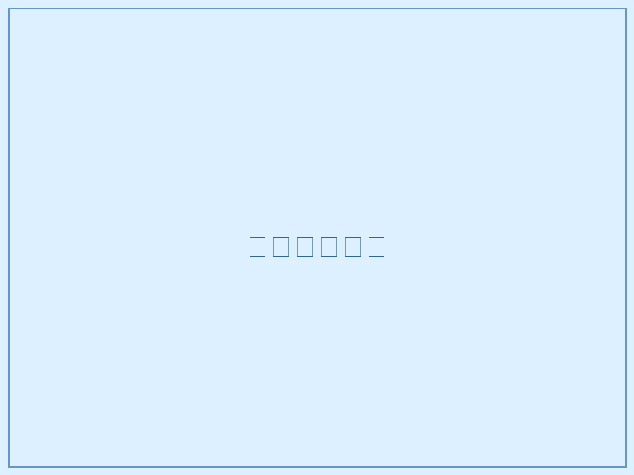
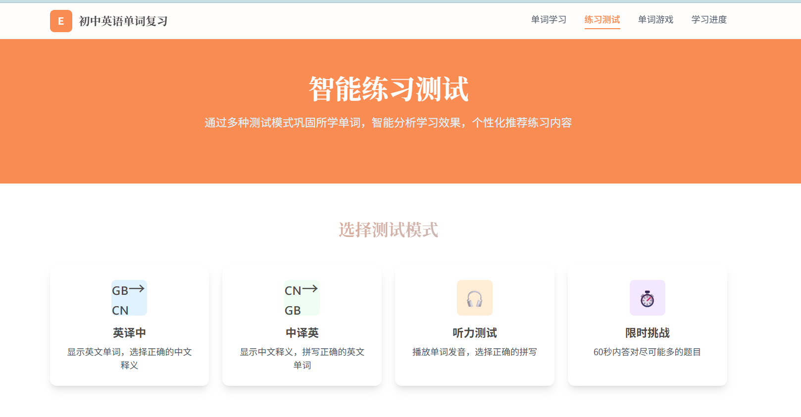
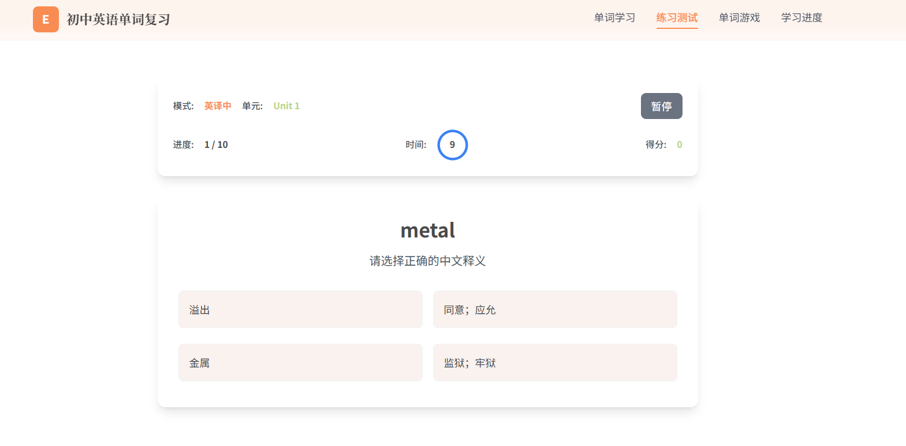

# words-website

一个面向初中英语词汇复习的纯前端学习网站，包含单词学习、练习测试、单词游戏和学习进度统计等页面。项目不依赖打包工具，直接用 HTML、JavaScript、Tailwind CSS CDN 和浏览器本地存储运行。

项目源仓库：[Kaitlin2220/words-website](https://github.com/Kaitlin2220/words-website)

## 项目功能

- 单词学习：按教材册别和 Unit 浏览单词，支持上一词/下一词、卡片翻转、难度标记和发音播放。
- 练习测试：支持英译中、中译英、听力等练习模式，可选择题量和练习单元。
- 单词游戏：包含单词消消乐和记忆翻牌等游戏化练习。
- 学习进度：展示学习统计、进度数据和可视化图表区域。
- 本地保存：使用 `localStorage` 保存学习进度和难度标记。

## 项目截图

### 单元选择



### 练习模式



### 答题界面



## 技术栈

- HTML5 + 原生 JavaScript
- Tailwind CSS CDN
- Anime.js
- ECharts
- Splide.js
- Matter.js
- p5.js
- Web Speech API，用于浏览器发音
- `localStorage`，用于本地学习记录

## 目录结构

```text
words-website/
├── index.html              # 单词学习首页
├── practice.html           # 练习测试页面
├── games.html              # 单词游戏页面
├── progress.html           # 学习进度页面
├── main.js                 # 公共学习逻辑、数据加载、进度存储、发音等
├── practice.js             # 练习测试逻辑
├── games.js                # 游戏逻辑
├── word_data.js            # 词汇数据，挂载到 window.wordData
├── word_list_full.txt      # 原始词汇文本
├── convert_full.py         # 将原始词汇文本转换为 word_data.js 的脚本
├── resources/              # 图片和音效资源
│   └── screenshots/        # README 展示截图
├── design.md               # 视觉设计说明
├── interaction.md          # 交互设计说明
└── outline.md              # 项目结构和功能大纲
```

## 打开方式

### 方式一：在线访问

项目已部署到 GitHub Pages，可以直接访问：

```text
https://kaitlin2220.github.io/words-website/
```

### 方式二：本地打开

双击打开 `index.html`，或在浏览器中打开以下页面：

- `index.html`
- `practice.html`
- `games.html`
- `progress.html`

### 方式三：启动本地服务器

如果浏览器对本地文件访问有限制，可以在项目根目录运行：

```bash
python -m http.server 8000
```

然后访问：

```text
http://localhost:8000
```

## 页面说明

### `index.html`

主学习页面。页面会加载 `word_data.js` 和 `main.js`，用户可以选择教材册别、选择 Unit、查看单词、播放发音、标记难度，并将学习记录保存到浏览器本地。

### `practice.html`

练习测试页面。页面会加载 `word_data.js`、`main.js` 和 `practice.js`，支持选择练习模式、选择单元、设置题量并查看答题结果。

### `games.html`

单词游戏页面。页面会加载 `word_data.js`、`main.js` 和 `games.js`，支持按单元进行游戏化练习。

### `progress.html`

学习进度页面。用于展示学习统计和图表内容，依赖页面内的统计区域与 ECharts 图表展示。

## 词汇数据

词汇数据位于 `word_data.js`，格式如下：

```javascript
window.wordData = {
  "七年级上册_Unit 1": [
    {
      "word": "German",
      "pos": "adj.",
      "translation": "德国的",
      "phonetic": ""
    }
  ]
};
```

当前 `word_data.js` 中约包含 46 个单元、1332 条词汇记录。

如果需要从 `word_list_full.txt` 重新生成数据，可以运行：

```bash
python convert_full.py
```

脚本会解析 `word_list_full.txt`，并输出新的 `word_data.js`。

## 本地存储

项目会在浏览器中保存以下数据：

- `wordLearningProgress`：学习进度
- `difficultyMarks`：单词难度标记

如果需要清空学习记录，可以在浏览器开发者工具的 Application/Storage 面板中删除对应的 `localStorage` 项。

## 注意事项

- 项目依赖多个 CDN 资源，离线环境下样式、字体、图表或动画可能无法正常加载。
- 浏览器发音功能依赖 Web Speech API，不同浏览器和系统的发音效果可能不同。
- 部分 HTML 和 Markdown 文件中的中文显示为乱码，疑似编码转换问题；建议统一保存为 UTF-8 后再继续维护。
- `progress.html` 的标题标签存在明显异常，后续可检查并修复页面 HTML 结构。
